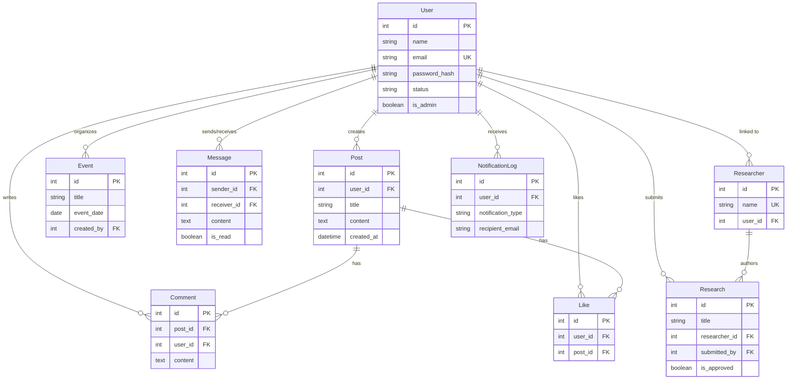

# PSRA Database Schema Documentation

This document provides a comprehensive overview of the database schema for the PSRA Flask application.

## Overview

- **Database Type**: Relational Database (SQL)
- **ORM**: Flask-SQLAlchemy
- **Default Database**: SQLite (`instance/psra.db` in development)
- **Migration Tool**: Flask-Migrate (Alembic)

## Entity Relationship Diagram (ERD)

## Table Definitions

### 1. User (`user`)

Core entity representing system users (students, alumni, undergraduates).

| Column Name | Type | Constraints | Default | Description |
| :--- | :--- | :--- | :--- | :--- |
| `id` | Integer | PK | Auto-inc | Unique identifier |
| `name` | String(100) | Not Null | | Full name |
| `email` | String(120) | UK, Not Null | | Email address (unique) |
| `password_hash` | String(128) | Nullable | | Hashed password (nullable for OAuth users) |
| `google_id` | String(100) | UK, Nullable | | Google OAuth ID for Sign in with Google |
| `batch_number` | Integer | Nullable | | Batch number (e.g., 2023) |
| `phone_number` | String(20) | Nullable | | Contact number |
| `whatsapp_number` | String(20) | Nullable | | WhatsApp contact |
| `is_member` | Boolean | | False | Membership status |
| `status` | String(20) | | 'student' | User type ('student', 'alumni', 'undergraduate') |
| `headline` | String(200) | Nullable | | Professional headline |
| `location` | String(100) | Nullable | | User location |
| `about` | Text | Nullable | | Bio / About section |
| `skills` | Text | Nullable | | Comma-separated skills |
| `education` | Text | Nullable | | JSON array of education history |
| `experience` | Text | Nullable | | JSON array of work experience |
| `linkedin_url` | String(200) | Nullable | | LinkedIn profile link |
| `website_url` | String(200) | Nullable | | Personal website link |
| `cover_photo_url` | String(200) | | None | URL to cover photo |
| `profile_picture_url` | String(200) | | None | URL to profile picture |
| `languages` | Text | Nullable | | Comma-separated languages |
| `certifications` | Text | Nullable | | JSON/Text for certifications |
| `projects` | Text | Nullable | | JSON/Text for projects |
| `publications` | Text | Nullable | | Research publications text |
| `professional_summary` | Text | Nullable | | Summary for CV/Resume |
| `is_admin` | Boolean | | False | Admin privileges flag |
| `email_notifications_enabled` | Boolean | | True | Preference |
| `event_reminders_enabled` | Boolean | | True | Preference |
| `new_research_alerts_enabled` | Boolean | | True | Preference |
| `created_at` | DateTime | | UTC Now | Account creation timestamp |

**Relationships:**
- `posts`: One-to-Many with `Post`
- `comments`: One-to-Many with `Comment`
- `likes`: One-to-Many with `Like`
- `events`: One-to-Many with `Event` (created events)
- `sent_messages`: One-to-Many with `Message` (as sender)
- `received_messages`: One-to-Many with `Message` (as receiver)
- `submitted_researches`: One-to-Many with `Research`
- `notification_logs`: One-to-Many with `NotificationLog`

---

### 2. Post (`post`)

User-generated content/posts in the forum.

| Column Name | Type | Constraints | Default | Description |
| :--- | :--- | :--- | :--- | :--- |
| `id` | Integer | PK | Auto-inc | Unique identifier |
| `user_id` | Integer | FK(`user.id`) | | Author of the post |
| `category` | String(50) | Not Null | | Category (e.g., 'Pharmacology') |
| `title` | String(200) | Not Null | | Post title |
| `content` | Text | Not Null | | Post body content |
| `image_url` | String(200) | | None | Optional post image |
| `created_at` | DateTime | | UTC Now | Creation timestamp |

**Relationships:**
- `comments`: One-to-Many with `Comment` (Cascade Delete)
- `likes`: One-to-Many with `Like` (Cascade Delete)
- `author`: Many-to-One with `User`

---

### 3. Comment (`comment`)

Comments on posts.

| Column Name | Type | Constraints | Default | Description |
| :--- | :--- | :--- | :--- | :--- |
| `id` | Integer | PK | Auto-inc | Unique identifier |
| `post_id` | Integer | FK(`post.id`) | | Parent post |
| `user_id` | Integer | FK(`user.id`) | | Comment author |
| `content` | Text | Not Null | | Comment text |
| `created_at` | DateTime | | UTC Now | Creation timestamp |

**Relationships:**
- `post`: Many-to-One with `Post`
- `author`: Many-to-One with `User`

---

### 4. Like (`like`)

Likes on posts. Prevents duplicate likes via unique constraint.

| Column Name | Type | Constraints | Default | Description |
| :--- | :--- | :--- | :--- | :--- |
| `id` | Integer | PK | Auto-inc | Unique identifier |
| `user_id` | Integer | FK(`user.id`) | | User who liked |
| `post_id` | Integer | FK(`post.id`) | | Post liked |

**Constraints:**
- `unique_user_post_like`: Unique(`user_id`, `post_id`)

**Relationships:**
- `user`: Many-to-One with `User`
- `post`: Many-to-One with `Post`

---

### 5. Event (`event`)

Events organized by users/admins.

| Column Name | Type | Constraints | Default | Description |
| :--- | :--- | :--- | :--- | :--- |
| `id` | Integer | PK | Auto-inc | Unique identifier |
| `title` | String(200) | Not Null | | Event title |
| `description` | Text | Nullable | | Detailed description |
| `event_date` | Date | Not Null | | Date of event |
| `event_time` | Time | Nullable | | Time of event |
| `image_url` | String(200) | | None | Event banner/image |
| `presenter` | String(200) | Nullable | | Name of presenter/speaker |
| `event_url` | String(500) | Nullable | | Link to event (e.g., Zoom) |
| `is_archived` | Boolean | | False | Archive status |
| `created_by` | Integer | FK(`user.id`) | | Creator ID |
| `created_at` | DateTime | | UTC Now | Creation timestamp |

**Relationships:**
- `creator`: Many-to-One with `User`

---

### 6. Message (`message`)

Private messages between users.

| Column Name | Type | Constraints | Default | Description |
| :--- | :--- | :--- | :--- | :--- |
| `id` | Integer | PK | Auto-inc | Unique identifier |
| `sender_id` | Integer | FK(`user.id`) | | Message sender |
| `receiver_id` | Integer | FK(`user.id`) | | Message recipient |
| `content` | Text | Not Null | | Message body |
| `is_read` | Boolean | | False | Read status |
| `read_at` | DateTime | Nullable | | Timestamp when read |
| `created_at` | DateTime | | UTC Now | Sent timestamp |

**Relationships:**
- `sender`: Many-to-One with `User`
- `receiver`: Many-to-One with `User`

---

### 7. Researcher (`researcher`)

Profiles for researchers (can be linked to a User or independent).

| Column Name | Type | Constraints | Default | Description |
| :--- | :--- | :--- | :--- | :--- |
| `id` | Integer | PK | Auto-inc | Unique identifier |
| `name` | String(200) | UK, Not Null | | Researcher name |
| `profile_picture_url` | String(200) | | None | Photo URL |
| `bio` | Text | Nullable | | Biography |
| `is_registered_user` | Boolean | | False | If linked to User account |
| `user_id` | Integer | FK(`user.id`) | Nullable | Linked User ID |
| `created_at` | DateTime | | UTC Now | Creation timestamp |

**Relationships:**
- `researches`: One-to-Many with `Research` (Cascade Delete)

---

### 8. Research (`research`)

Research papers and publications.

| Column Name | Type | Constraints | Default | Description |
| :--- | :--- | :--- | :--- | :--- |
| `id` | Integer | PK | Auto-inc | Unique identifier |
| `title` | String(500) | Not Null | | Paper title |
| `doi_url` | String(500) | Nullable | | DOI or Link to paper |
| `department` | String(100) | Not Null | | Department category |
| `year` | Integer | Not Null | | Publication year |
| `researcher_id` | Integer | FK(`researcher.id`) | | Primary author |
| `researcher_type` | String(20) | | 'doctor' | 'doctor' or 'student' |
| `is_approved` | Boolean | | True | Approval status |
| `submitted_by` | Integer | FK(`user.id`) | Nullable | User who submitted entry |
| `created_at` | DateTime | | UTC Now | Creation timestamp |

**Relationships:**
- `author`: Many-to-One with `Researcher`
- `submitted_by_user`: Many-to-One with `User`

**Department Choices:**
- Pharmaceutics & Drug Delivery
- Pharmacology & Toxicology
- Clinical Pharmacy & Pharmacy Practice
- Pharmaceutical Chemistry

---

### 9. NotificationLog (`notification_log`)

Logs of system notifications sent (emails, etc.).

| Column Name | Type | Constraints | Default | Description |
| :--- | :--- | :--- | :--- | :--- |
| `id` | Integer | PK | Auto-inc | Unique identifier |
| `user_id` | Integer | FK(`user.id`) | Nullable | Target user (Null for bulk) |
| `notification_type` | String(50) | Not Null | | Type code (e.g., 'event_reminder') |
| `reference_id` | Integer | Nullable | | ID of related object (Event/Research) |
| `recipient_email` | String(120) | Not Null | | Email address sent to |
| `subject` | String(200) | Not Null | | Email subject |
| `sent_at` | DateTime | | UTC Now | Sent timestamp |
| `status` | String(20) | | 'sent' | Status ('sent', 'failed') |
| `error_message` | Text | Nullable | | Error details if failed |

**Relationships:**
- `user`: Many-to-One with `User`
