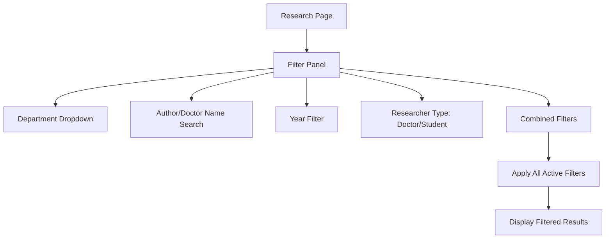
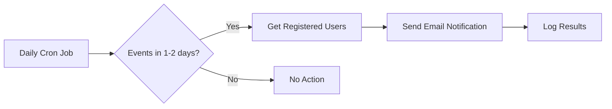
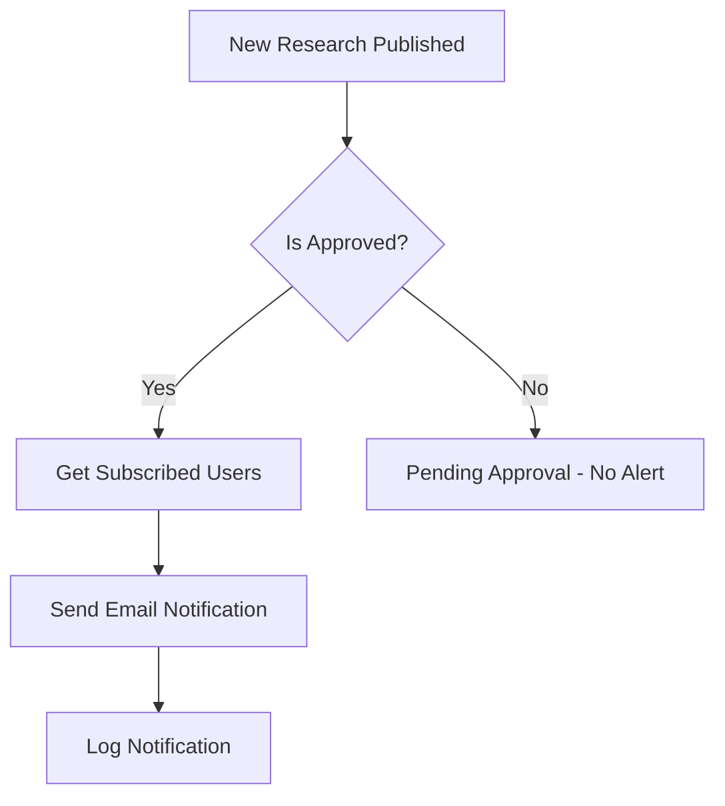
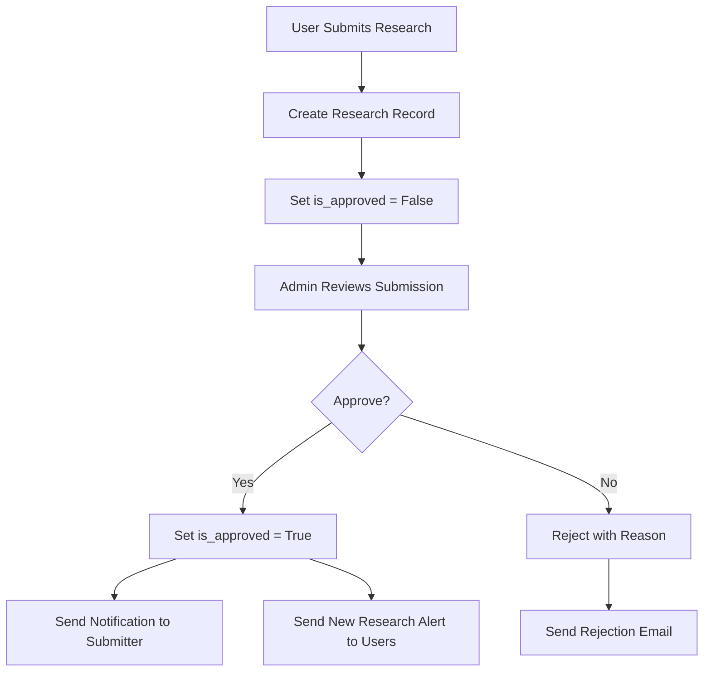
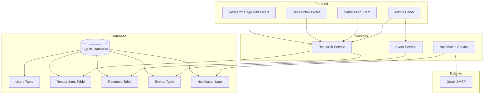

# PSRA Client Features Implementation Plan

## Overview

This document outlines the implementation plan for new features requested by the client for the PSRA (Pharmaceutical Studies and Research Association) website. The features include:

1. **Research Categorization & Filtering** - Department categories, advanced search filters
2. **Doctor/Researcher Profiles** - Auto-generated profiles for researchers
3. **Notification System** - Event reminders and new research alerts via Gmail
4. **Research Submission Form** - Allow researchers to submit their work

---

## Current Architecture Summary

### Existing Structure
```
psra-flask/
|-- app.py                 # Main Flask application
|-- models.py              # Database models (User, Post, Comment, Event, Message)
|-- config.py              # Configuration classes
|-- researches.csv         # Current research data storage (to be migrated)
|-- admin/                 # Admin blueprint
|-- forum/                 # Forum blueprint (auth, posts, profiles)
|-- services/              # Business logic services
|-- utils/                 # Utility modules
|-- templates/             # Jinja2 templates
```

### Current Research CSV Structure
| Column | Description |
|--------|-------------|
| Name of Researcher | Doctor/Author name |
| Title of Research | Research paper title |
| DOI of the Research | Link to research |
| Department Name | Department category |
| Date | Year of publication |

### Existing Departments (from CSV)
- Pharmaceutics & Drug Delivery
- Pharmacology & Toxicology
- Clinical Pharmacy & Pharmacy Practice
- Pharmaceutical Chemistry

---

## Phase 1: Database Migration - Research Model

### 1.1 Create Research Model

Add new model to [`models.py`](models.py):

```python
class Research(db.Model):
    id = db.Column(db.Integer, primary_key=True)
    title = db.Column(db.String(500), nullable=False)
    doi_url = db.Column(db.String(500), nullable=True)
    department = db.Column(db.String(100), nullable=False)
    year = db.Column(db.Integer, nullable=False)
    researcher_id = db.Column(db.Integer, db.ForeignKey('researcher.id'), nullable=False)
    researcher_type = db.Column(db.String(20), default='doctor')  # 'doctor' or 'student'
    created_at = db.Column(db.DateTime, default=datetime.utcnow)
    is_approved = db.Column(db.Boolean, default=True)  # For submitted research
```

### 1.2 Create Researcher Model

Add new model for auto-generated researcher profiles:

```python
class Researcher(db.Model):
    id = db.Column(db.Integer, primary_key=True)
    name = db.Column(db.String(200), nullable=False, unique=True)
    profile_picture_url = db.Column(db.String(200), default=None)
    bio = db.Column(db.Text, nullable=True)
    is_registered_user = db.Column(db.Boolean, default=False)
    user_id = db.Column(db.Integer, db.ForeignKey('user.id'), nullable=True)
    created_at = db.Column(db.DateTime, default=datetime.utcnow)
    
    # Relationship to research papers
    researches = db.relationship('Research', backref='author', lazy=True)
```

### 1.3 Migration Script

Create a migration script to:
1. Create new tables (researcher, research)
2. Import data from [`researches.csv`](researches.csv)
3. Auto-generate researcher profiles from CSV data

---

## Phase 2: Doctor/Researcher Profiles

### 2.1 Researcher Profile Page

Create a new route for researcher profiles:

| Route | Template | Description |
|-------|----------|-------------|
| `/researcher/<int:id>` | `researcher_profile.html` | Display researcher with all their research |
| `/researchers` | `researchers.html` | List all researchers |

### 2.2 Researcher Profile Features

- Display researcher name and bio
- List all research papers by the researcher
- Filter research by year on profile page
- Link to individual research papers (DOI)

### 2.3 Admin Management

Add admin routes for:
- Edit researcher profile (add bio, profile picture)
- Link researcher to registered user account
- Add new research to existing researcher

---

## Phase 3: Research Categorization & Filtering

### 3.1 Department Categories

Implement the 4 existing departments as filter options:

1. Pharmaceutics & Drug Delivery
2. Pharmacology & Toxicology
3. Clinical Pharmacy & Pharmacy Practice
4. Pharmaceutical Chemistry

### 3.2 Advanced Search Filters

Update [`templates/researches.html`](templates/researches.html) with:



### 3.3 Filter Implementation

| Filter | Implementation | Works Independently | Combined |
|--------|---------------|---------------------|----------|
| Department | `Research.department == selected` | Yes | Yes |
| Author Name | `Researcher.name.ilike(name)` | Yes | Yes |
| Year | `Research.year == year` | Yes | Yes |
| Researcher Type | `Research.researcher_type == type` | Yes | Yes |

### 3.4 Research Service

Create [`services/research_service.py`](services/research_service.py):

```python
class ResearchService:
    @staticmethod
    def get_filtered_research(department=None, author=None, year=None, researcher_type=None):
        # Build query with filters
        pass
    
    @staticmethod
    def get_researcher_profile(researcher_id):
        pass
    
    @staticmethod
    def get_all_researchers():
        pass
```

---

## Phase 4: Notification System

### 4.1 Gmail API with OAuth2 Configuration

The project uses Gmail API with OAuth2 authentication via [`client_secret.json`](client_secret.json):

```json
{
  "web": {
    "client_id": "758243568964-pog0m97skpgi2vk5grhr02gvvje7s5m4.apps.googleusercontent.com",
    "project_id": "psra-website-noti",
    "auth_uri": "https://accounts.google.com/o/oauth2/auth",
    "token_uri": "https://oauth2.googleapis.com/token"
  }
}
```

**Implementation Requirements**:
1. Add `google-auth`, `google-auth-oauthlib`, `google-api-python-client` to [`requirements.txt`](requirements.txt)
2. Create OAuth2 callback route for initial authorization
3. Store refresh token in database or secure file
4. Use Gmail API to send notifications

**User Notification Preferences**:
Add to User model:
```python
email_notifications_enabled = db.Column(db.Boolean, default=True)
event_reminders_enabled = db.Column(db.Boolean, default=True)
new_research_alerts_enabled = db.Column(db.Boolean, default=True)
```

### 4.2 Event Reminder System

Create a scheduled task for event notifications:



Implementation approach:
- Create [`utils/notification_utils.py`](utils/notification_utils.py)
- Add `NotificationLog` model to track sent notifications
- Create a Flask CLI command for the cron job

### 4.3 New Research Alert System



### 4.4 Notification Models

Add to [`models.py`](models.py):

```python
class NotificationLog(db.Model):
    id = db.Column(db.Integer, primary_key=True)
    user_id = db.Column(db.Integer, db.ForeignKey('user.id'))
    notification_type = db.Column(db.String(50))  # 'event_reminder', 'new_research'
    reference_id = db.Column(db.Integer)  # event_id or research_id
    sent_at = db.Column(db.DateTime, default=datetime.utcnow)
    status = db.Column(db.String(20))  # 'sent', 'failed'
```

### 4.5 Email Templates

Create email templates for:
- Event reminder (1-2 days before)
- New research publication alert

---

## Phase 5: Research Submission Form

### 5.1 Submission Form Fields

**Requirement**: Students must be registered users to submit research.

| Field | Type | Required | Description |
|-------|------|----------|-------------|
| Researcher Name | Text | Yes | Name of the researcher |
| Researcher Type | Select | Yes | Doctor or Student (linked to user account) |
| Research Title | Text | Yes | Title of the research |
| DOI/URL | URL | No | Link to the research |
| Department | Select | Yes | Department category |
| Year | Number | Yes | Year of publication |
| Submitter User ID | Foreign Key | Yes | Linked to registered user account |

### 5.2 Submission Workflow



### 5.3 Routes

| Route | Method | Template | Description |
|-------|--------|----------|-------------|
| `/submit-research` | GET, POST | `submit_research.html` | Submission form |
| `/admin/submissions` | GET | `admin/submissions.html` | List pending submissions |
| `/admin/submissions/<id>/approve` | POST | - | Approve submission |
| `/admin/submissions/<id>/reject` | POST | - | Reject submission |

---

## Implementation Order

### Step 1: Database Changes [COMPLETED]
1. [x] Add `Researcher` model to [`models.py`](models.py)
2. [x] Add `Research` model to [`models.py`](models.py)
3. [x] Add `NotificationLog` model to [`models.py`](models.py)
4. [x] Add notification preferences to User model
5. [x] Create database migration
6. [x] Create data migration script for CSV import (migrate_researches.py)

### Step 2: Research Service Layer [COMPLETED]
1. [x] Create [`services/research_service.py`](services/research_service.py)
2. [x] Implement filtering logic (department, year, researcher, search)
3. [x] Implement researcher profile logic
4. [x] Implement submission workflow methods

### Step 3: Routes and Templates [COMPLETED]
1. [x] Update research route in [`app.py`](app.py)
2. [x] Create researcher profile routes (`/researcher/<id>`, `/researchers`)
3. [x] Create submission routes (`/submit-research`)
4. [x] Update [`templates/researches.html`](templates/researches.html) with filters
5. [x] Create [`templates/researcher_profile.html`](templates/researcher_profile.html)
6. [x] Create [`templates/researchers.html`](templates/researchers.html)
7. [x] Create [`templates/submit_research.html`](templates/submit_research.html)

### Step 4: Admin Features [COMPLETED]
1. [x] Add submission management to [`admin/routes.py`](admin/routes.py)
2. [x] Add researcher management routes to [`admin/routes.py`](admin/routes.py)
3. [x] Create [`templates/admin/submissions.html`](templates/admin/submissions.html)
4. [x] Create [`templates/admin/researchers.html`](templates/admin/researchers.html)
5. [x] Create [`templates/admin/edit_researcher.html`](templates/admin/edit_researcher.html)

### Step 5: Notification System [COMPLETED]
1. [x] Create [`utils/notification_utils.py`](utils/notification_utils.py)
2. [x] Add notification functions to [`utils/email_utils.py`](utils/email_utils.py)
3. [x] Create Flask CLI commands for scheduled notifications
4. [x] Integrate with research approval workflow

### Step 6: Testing and Documentation [COMPLETED]
1. [x] Test all filters independently and combined
2. [x] Test notification system
3. [x] Test submission workflow
4. [x] Update documentation

---

## Files to Create/Modify

### New Files [CREATED]
| File | Purpose | Status |
|------|---------|--------|
| [`services/research_service.py`](services/research_service.py) | Research business logic | Created |
| [`utils/notification_utils.py`](utils/notification_utils.py) | Notification scheduling utilities | Created |
| [`templates/researcher_profile.html`](templates/researcher_profile.html) | Researcher profile page | Created |
| [`templates/researchers.html`](templates/researchers.html) | List of all researchers | Created |
| [`templates/submit_research.html`](templates/submit_research.html) | Submission form | Created |
| [`templates/admin/submissions.html`](templates/admin/submissions.html) | Admin submission management | Created |
| [`templates/admin/researchers.html`](templates/admin/researchers.html) | Admin researcher management | Created |
| [`templates/admin/edit_researcher.html`](templates/admin/edit_researcher.html) | Admin edit researcher form | Created |
| [`migrate_researches.py`](migrate_researches.py) | CSV to database migration script | Created |
| `migrations/versions/*.py` | Database migrations | Created |

### Modified Files [UPDATED]
| File | Changes | Status |
|------|---------|--------|
| [`models.py`](models.py) | Added Researcher, Research, NotificationLog models; notification preferences to User | Updated |
| [`app.py`](app.py) | Added research routes, submission routes, CLI commands | Updated |
| [`admin/routes.py`](admin/routes.py) | Added submission management routes, notification integration | Updated |
| [`templates/researches.html`](templates/researches.html) | Added filter UI components, statistics, pagination | Updated |
| [`utils/email_utils.py`](utils/email_utils.py) | Added notification email functions | Updated |
| [`forum/forms.py`](forum/forms.py) | Added ResearchSubmissionForm | Updated |
| [`services/__init__.py`](services/__init__.py) | Added ResearchService export | Updated |

---

## Gmail Setup Instructions for Client

To enable email notifications via Gmail:

1. **Enable 2-Factor Authentication**
   - Go to Google Account settings
   - Navigate to Security > 2-Step Verification
   - Enable 2FA if not already enabled

2. **Generate App Password**
   - Go to Google Account > Security > App Passwords
   - Create a new app password for "Mail" on "Windows Computer"
   - Copy the generated 16-character password

3. **Update Configuration**
   - Add the App Password to the `.env` file:
   ```
   MAIL_PASSWORD=your-16-char-app-password
   ```

---

## Client Clarifications (Resolved)

1. **Student Submissions**: Students must be registered users to submit research
2. **Notification Opt-out**: Users can opt-out of notifications (add preference to User model)
3. **Email Authentication**: Use Gmail API with OAuth2 (client_secret.json) instead of SMTP App Password

---

## Architecture Diagram



---

## Summary

This implementation plan covers all client-requested features:

| Feature | Status | Complexity |
|---------|--------|------------|
| Department Categories | Completed | Low |
| Advanced Search Filters | Completed | Medium |
| Researcher Profiles | Completed | Medium |
| Event Notifications | Completed | Medium |
| New Research Alerts | Completed | Medium |
| Submission Form | Completed | Medium |
| Admin Researcher Management | Completed | Medium |

**Implementation Completed:**
- 3 new models (Researcher, Research, NotificationLog)
- 1 new service module (research_service.py)
- 1 new utility module (notification_utils.py)
- 3 new templates (researcher_profile.html, researchers.html, submit_research.html)
- 3 new admin templates (admin/submissions.html, admin/researchers.html, admin/edit_researcher.html)
- Modified existing files (models.py, app.py, admin/routes.py, templates/researches.html, utils/email_utils.py)
- Database migration and CSV data import (363 research entries, 16 researchers)
- Researcher Type filter (Doctor/Student) added to research filtering

**All planned features have been implemented successfully.**

---

## CLI Commands Available

The following Flask CLI commands are available for notification management:

```bash
# Send event reminders for events happening tomorrow
python -m flask send-event-reminders

# Send new research alerts (optionally for a specific research ID)
python -m flask send-new-research-alerts
python -m flask send-new-research-alerts --research-id=123

# View notification statistics
python -m flask notification-stats
```

For scheduled execution, set up a cron job or task scheduler:
```
# Example cron entry (runs daily at 9 AM)
0 9 * * * cd /path/to/psra-flask && python -m flask send-event-reminders
```