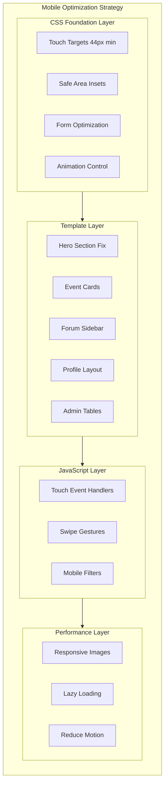

# Mobile Optimization Plan for PSRA Website

## Executive Summary

This plan outlines a comprehensive strategy to optimize the PSRA (Pharmaceutical Studies and Research Association) web application for mobile viewing. The analysis identified several areas requiring attention across CSS, templates, and JavaScript.

---

## Current State Analysis

### Existing Mobile Support (What's Working)

1. **CSS Design System**
   - Well-structured CSS variables for consistent theming
   - Existing responsive breakpoints at 480px, 768px, and 1024px
   - Dark mode support with proper color schemes

2. **Navigation**
   - Hamburger menu toggle implemented
   - Navigation collapses on mobile screens
   - Dropdown menus have basic mobile support

3. **Layout Components**
   - Grid system with responsive classes
   - Container with responsive padding
   - Basic flexbox utilities

### Identified Issues

#### Critical Issues

| Issue | Location | Impact |
|-------|----------|--------|
| Hero section uses `h-screen` causing mobile height issues | [`home.html`](templates/home.html:7) | Poor first impression on mobile |
| Touch targets too small | Navigation links, buttons | Accessibility and usability |
| Form inputs lack mobile optimization | Various templates | Difficult form completion |
| Tables overflow on small screens | Admin templates | Content inaccessible |
| Inline styles in edit_profile.html | [`edit_profile.html`](templates/edit_profile.html) | Inconsistent mobile behavior |

#### High Priority Issues

| Issue | Location | Impact |
|-------|----------|--------|
| Event cards not optimized for mobile | [`events.html`](templates/events.html) | Poor event browsing experience |
| Forum sidebar layout breaks on mobile | [`forum_main.html`](templates/forum_main.html) | Navigation difficulties |
| Profile timeline needs mobile adjustment | [`profile.html`](templates/profile.html) | Content readability |
| Image handling in discussions | [`home.html`](templates/home.html:134) | Images may overflow |
| Modal and overlay touch issues | Various | Interaction problems |

#### Medium Priority Issues

| Issue | Location | Impact |
|-------|----------|--------|
| Footer spacing on very small screens | [`base.html`](templates/base.html) | Visual inconsistency |
| Toast notifications positioning | [`style.css`](static/css/style.css) | May obscure content |
| Social auth buttons on small screens | [`login.html`](templates/login.html) | Touch target issues |
| Quick actions grid in admin | [`admin/dashboard.html`](templates/admin/dashboard.html) | Button overflow |

---

## Optimization Strategy

### Phase 1: CSS Foundation Enhancements

#### 1.1 Improve Touch Targets

```css
/* Add to style.css responsive section */
@media (max-width: 768px) {
    /* Minimum 44px touch targets for iOS */
    .nav-link,
    .btn,
    .form-input,
    .form-select {
        min-height: 44px;
        padding: var(--space-3) var(--space-4);
    }
    
    /* Increase tap highlight area */
    .nav-link::before {
        content: '';
        position: absolute;
        top: -10px;
        left: -10px;
        right: -10px;
        bottom: -10px;
    }
}
```

#### 1.2 Enhanced Form Optimization

```css
/* Mobile form optimizations */
@media (max-width: 768px) {
    .form-input,
    .form-select,
    .form-textarea {
        font-size: 16px; /* Prevents iOS zoom on focus */
        -webkit-appearance: none;
        border-radius: var(--radius-lg);
    }
    
    .form-label {
        font-size: var(--font-size-base);
        margin-bottom: var(--space-2);
    }
    
    .form-group {
        margin-bottom: var(--space-6);
    }
}
```

#### 1.3 Safe Area Insets for Notched Devices

```css
/* Add to :root or base styles */
@supports (padding: max(0px)) {
    .header {
        padding-top: max(var(--space-4), env(safe-area-inset-top));
    }
    
    .footer {
        padding-bottom: max(var(--space-4), env(safe-area-inset-bottom));
    }
    
    .container {
        padding-left: max(var(--space-4), env(safe-area-inset-left));
        padding-right: max(var(--space-4), env(--safe-area-inset-right));
    }
}
```

### Phase 2: Template-Specific Optimizations

#### 2.1 Home Page Hero Section

**File**: [`templates/home.html`](templates/home.html)

**Current Issue**: `h-screen` class causes height problems on mobile browsers

**Solution**:
```html
<!-- Change from -->
<div class="hero-section relative h-screen ...">

<!-- To -->
<div class="hero-section relative min-h-screen md:h-screen ...">
```

**Additional Changes**:
- Reduce hero title font size on mobile
- Adjust hero content padding
- Optimize background image for mobile loading

#### 2.2 Events Page

**File**: [`templates/events.html`](templates/events.html)

**Changes Required**:
```css
/* Add mobile-specific event card styles */
@media (max-width: 768px) {
    .event-header {
        flex-direction: column;
        align-items: flex-start;
        gap: var(--space-3);
    }
    
    .event-date {
        width: 100%;
        padding: var(--space-3);
    }
    
    .event-image img {
        max-height: 200px;
        object-fit: cover;
    }
}
```

#### 2.3 Forum Page

**File**: [`templates/forum_main.html`](templates/forum_main.html)

**Changes Required**:
- Make sidebar collapsible on mobile
- Add toggle button for filters
- Stack post cards properly

```html
<!-- Add mobile sidebar toggle -->
<button class="forum-filter-toggle md:hidden" id="filter-toggle">
    <i class="fas fa-filter"></i> Filters
</button>
```

#### 2.4 Profile Page

**File**: [`templates/profile.html`](templates/profile.html)

**Changes Required**:
- Stack profile header content on mobile
- Adjust timeline for vertical display
- Optimize avatar size

```css
@media (max-width: 768px) {
    .profile-content-wrapper {
        flex-direction: column;
        text-align: center;
    }
    
    .profile-avatar {
        margin: 0 auto var(--space-4);
    }
    
    .timeline {
        padding-left: var(--space-4);
    }
}
```

#### 2.5 Edit Profile Page

**File**: [`templates/edit_profile.html`](templates/edit_profile.html)

**Critical Issue**: Extensive inline styles prevent responsive behavior

**Solution**: Refactor inline styles to CSS classes

```html
<!-- Change from inline styles -->
<div style="background: white; padding: 30px; border-radius: 10px; ...">

<!-- To CSS classes -->
<div class="profile-edit-card">
```

### Phase 3: Navigation Enhancements

#### 3.1 Improved Mobile Menu

**File**: [`templates/base.html`](templates/base.html)

**Enhancements**:
- Add slide-in animation for mobile menu
- Improve dropdown touch handling
- Add close button inside mobile menu

```javascript
// Enhanced mobile menu with swipe-to-close
let touchStartX = 0;
const mainNav = document.getElementById('main-nav');

mainNav.addEventListener('touchstart', (e) => {
    touchStartX = e.touches[0].clientX;
});

mainNav.addEventListener('touchend', (e) => {
    const touchEndX = e.changedTouches[0].clientX;
    if (touchStartX - touchEndX > 50) {
        mainNav.classList.remove('active');
    }
});
```

#### 3.2 Bottom Navigation Option

Consider adding a bottom navigation bar for mobile users:

```html
<!-- Add to base.html after main content -->
<nav class="mobile-bottom-nav md:hidden">
    <a href="{{ url_for('home') }}" class="mobile-nav-item">
        <i class="fas fa-home"></i>
        <span>Home</span>
    </a>
    <a href="{{ url_for('forum.forum_main') }}" class="mobile-nav-item">
        <i class="fas fa-comments"></i>
        <span>Forum</span>
    </a>
    <!-- More items -->
</nav>
```

### Phase 4: Performance Optimizations

#### 4.1 Image Optimization

```html
<!-- Add responsive images -->

```

#### 4.2 Lazy Loading

```html
<!-- Add lazy loading to below-fold images -->

```

#### 4.3 Reduce Animation on Mobile

```css
@media (max-width: 768px) {
    /* Reduce motion for better performance */
    *,
    *::before,
    *::after {
        animation-duration: 0.01ms !important;
        animation-iteration-count: 1 !important;
        transition-duration: 0.01ms !important;
    }
    
    /* Keep essential transitions */
    .nav-main,
    .nav-dropdown-menu {
        transition-duration: 200ms !important;
    }
}
```

### Phase 5: Admin Panel Mobile Support

#### 5.1 Admin Dashboard

**File**: [`templates/admin/dashboard.html`](templates/admin/dashboard.html)

**Changes**:
- Stack statistics cards
- Wrap quick actions
- Horizontal scroll for tables

```css
@media (max-width: 768px) {
    .admin-stats {
        grid-template-columns: repeat(2, 1fr);
        gap: var(--space-3);
    }
    
    .quick-actions {
        display: flex;
        flex-wrap: wrap;
        gap: var(--space-2);
    }
    
    .quick-actions .btn {
        flex: 1 1 calc(50% - var(--space-2));
        min-width: 140px;
    }
}
```

#### 5.2 Admin Tables

Add horizontal scroll wrapper for all admin tables:

```html
<div class="table-responsive">
    <table class="admin-table">
        <!-- table content -->
    </table>
</div>
```

```css
.table-responsive {
    overflow-x: auto;
    -webkit-overflow-scrolling: touch;
}
```

---

## Implementation Checklist

### CSS Changes (static/css/style.css)

- [ ] Add touch target minimum sizes
- [ ] Implement safe area insets
- [ ] Add mobile form optimizations
- [ ] Enhance mobile navigation styles
- [ ] Add bottom navigation styles
- [ ] Create table responsive wrapper
- [ ] Add mobile animation reductions
- [ ] Enhance event card mobile styles
- [ ] Add forum mobile styles
- [ ] Improve profile mobile styles

### Template Changes

#### High Priority
- [ ] [`home.html`](templates/home.html) - Fix hero section height
- [ ] [`edit_profile.html`](templates/edit_profile.html) - Refactor inline styles
- [ ] [`events.html`](templates/events.html) - Mobile event cards
- [ ] [`forum_main.html`](templates/forum_main.html) - Mobile sidebar

#### Medium Priority
- [ ] [`profile.html`](templates/profile.html) - Mobile profile layout
- [ ] [`login.html`](templates/login.html) - Form optimization
- [ ] [`register.html`](templates/register.html) - Form optimization
- [ ] [`base.html`](templates/base.html) - Navigation enhancements

#### Low Priority
- [ ] [`admin/dashboard.html`](templates/admin/dashboard.html) - Admin mobile support
- [ ] [`admin/events.html`](templates/admin/events.html) - Admin tables
- [ ] [`admin/researches.html`](templates/admin/researches.html) - Admin tables

### JavaScript Changes (static/js/script.js)

- [ ] Add touch event handlers for navigation
- [ ] Implement swipe-to-close for mobile menu
- [ ] Add mobile filter toggle for forum
- [ ] Improve dropdown touch handling

---

## Testing Strategy

### Device Testing Matrix

| Device Category | Viewport Width | Priority |
|-----------------|----------------|----------|
| iPhone SE | 375px | High |
| iPhone 12/13/14 | 390px | High |
| iPhone Plus/Max | 428px | Medium |
| Android Standard | 360px | High |
| Android Large | 412px | Medium |
| iPad Mini | 768px | Medium |
| iPad Pro | 1024px | Low |

### Browser Testing

- Safari iOS (primary)
- Chrome Android (primary)
- Firefox Mobile
- Samsung Internet

### Testing Scenarios

1. **Navigation Flow**
   - Open/close mobile menu
   - Navigate between pages
   - Use dropdown menus
   - Access user profile

2. **Form Interactions**
   - Login form completion
   - Registration flow
   - Profile editing
   - Research submission

3. **Content Consumption**
   - Read forum posts
   - View events
   - Browse profiles
   - Access research papers

4. **Admin Functions**
   - Dashboard access
   - Content management
   - User management

---

## Architecture Diagram



---

## Risk Assessment

| Risk | Likelihood | Impact | Mitigation |
|------|------------|--------|------------|
| Breaking existing desktop layout | Medium | High | Test all breakpoints after changes |
| Performance regression | Low | Medium | Monitor load times, use lazy loading |
| Browser compatibility issues | Medium | Medium | Test across browsers, use vendor prefixes |
| Touch event conflicts | Low | Medium | Proper event propagation handling |

---

## Success Metrics

1. **Google Lighthouse Mobile Score**: Target 90+
2. **First Contentful Paint**: Under 1.5s on 3G
3. **Time to Interactive**: Under 3.5s on 3G
4. **Touch Target Compliance**: 100% targets over 44px
5. **Viewport Configuration**: Proper scaling on all devices

---

## Next Steps

1. Review and approve this plan
2. Switch to Code mode for implementation
3. Implement CSS foundation changes first
4. Update templates in priority order
5. Add JavaScript enhancements
6. Test across device matrix
7. Deploy and monitor

---

*Plan created: February 2026*
*Last updated: February 2026*
